# Model Analysis Report

> Comprehensive evaluation of RT-DETR object detection model on BDD100K dataset

The model analysis  can be found in this notebook:  
[Model Analysis Notebook](../notebooks/model_analysis.ipynb)

---

## Table of Contents

1. [Executive Summary](#executive-summary)
2. [Model Overview](#model-overview)
3. [Evaluation Metrics](#evaluation-metrics)
4. [Performance Analysis](#performance-analysis)
5. [Error Analysis](#error-analysis)
6. [Bias Analysis](#bias-analysis)
7. [Scene & Size Performance](#scene--size-performance)
8. [Limitations & Gaps](#limitations--gaps)
9. [Recommendations](#recommendations)
10. [Conclusion](#conclusion)

---

## Executive Summary

This report evaluates the performance of **RT-DETR (Real-Time DETR)** with ResNet-50-vd backbone, pretrained on COCO and O365 datasets, when evaluated on the BDD100K autonomous driving dataset.

### Key Findings at a Glance:

| Metric | Score | Remark |
|--------|-------|--------|
| **Overall mAP (IoU 0.50:0.95)** | 0.122 |  Poor |
| **Precision** | 92.9% | Excellent |
| **Recall** | 24.7% | Critical |
| **F1 Score** | 0.391 | Moderate |
| **Large Object AP** | 0.320 | Fair |
| **Small Object AP** | 0.014 | Very Poor |

### Bottom Line:

The model achieves **high precision but critical recall failure**, meaning it only detects ~25% of actual objects while maintaining high confidence in what it does detect. This is a **classic domain shift problem**—the model trained on COCO/O365 lacks the domain knowledge needed for BDD100K's specific characteristics.

---

## Model Overview

### Model Configuration

```
Model:          RT-DETR (Real-Time Detection Transformer)
Backbone:       ResNet-50-vd
Pretraining:    COCO Object Detection Dataset + O365 Dataset
Framework:      PaddlePaddle (PekingU/rtdetr_r50vd_coco_o365)
Input Resolution: 640x640 (typical)
Training Data:  NOT fine-tuned on BDD100K
```

### Why This Model?

**RT-DETR Strengths:**
- Strong performance on COCO benchmark
- Transformer-based architecture for global context
- Good balance of speed and accuracy

**Expected Domain Gap Issues:**
- COCO trained on diverse everyday objects
- BDD100K focused on autonomous driving scenarios
- Different object distributions, scales, and spatial patterns
- Missing classes in COCO (traffic lights, traffic signs)

---

## Evaluation Metrics

### COCO-Style Average Precision (AP)

#### Overall Performance

| Metric | Value | Interpretation |
|--------|-------|-----------------|
| **AP @[IoU=0.50:0.95, area=all, maxDets=100]** | **0.122** | Very loose matching at all IoU thresholds |
| **AP @[IoU=0.50, area=all, maxDets=100]** | **0.173** | Slightly better with loose IoU threshold |
| **AP @[IoU=0.75, area=all, maxDets=100]** | **0.132** | Drops with stricter IoU requirement |

#### Performance by Object Size

| Size Category | AP Value | Status | Implication |
|--------------|----------|--------|-------------|
| **Small objects** (<32² px) | **0.014** | Failed | Model almost cannot detect small objects |
| **Medium objects** (32²-96² px) | **0.116** | Very Poor | Moderate detection failure |
| **Large objects** (>96² px) | **0.320** | Fair | Only decent performance on large objects |

### Average Recall (AR)

| Metric | Value | Meaning |
|--------|-------|---------|
| **AR @maxDets=1** | 0.098 | Only 9.8% detected with single detection |
| **AR @maxDets=10** | 0.143 | 14.3% detected allowing 10 predictions per image |
| **AR @maxDets=100** | 0.143 | Maxes out at 14.3% even with 100 predictions |

#### Recall by Object Size

| Size | Recall | Analysis |
|------|--------|----------|
| **Small** | 0.013 (1.3%) | Essentially no small object detection |
| **Medium** | 0.137 (13.7%) | Missing 86% of medium objects |
| **Large** | 0.370 (37%) | Missing 63% of large objects |

### Summary Metrics

| Metric | Score | Status |
|--------|-------|--------|
| **Precision** | 0.929 (92.9%) | Excellent |
| **Recall** | 0.2474 (24.7%) | Critical |
| **F1 Score** | 0.3907 | Moderate |

### Metric Interpretation

**High Precision + Low Recall Pattern:**
- Model is **very conservative** in making predictions
- When it does predict, it's usually correct (92.9% confidence)
- But it misses **75% of actual objects** in the scene
- This indicates the model is **overly confident** in its limited detections

**Root Cause:**
Domain Shift - The model was trained to detect COCO classes with COCO distributions. When facing BDD's different:
- Spatial patterns (center-biased in BDD)
- Object scales (more small objects in BDD)
- Class distributions (cars dominate in BDD)
- Environmental conditions (varied weather/time in BDD)

The model has low recall but produces high-confidence detections. This shows that the model is highly precise. 

---

## Performance Analysis

### Detection Performance Visualizations

#### Model Output Distribution Analysis

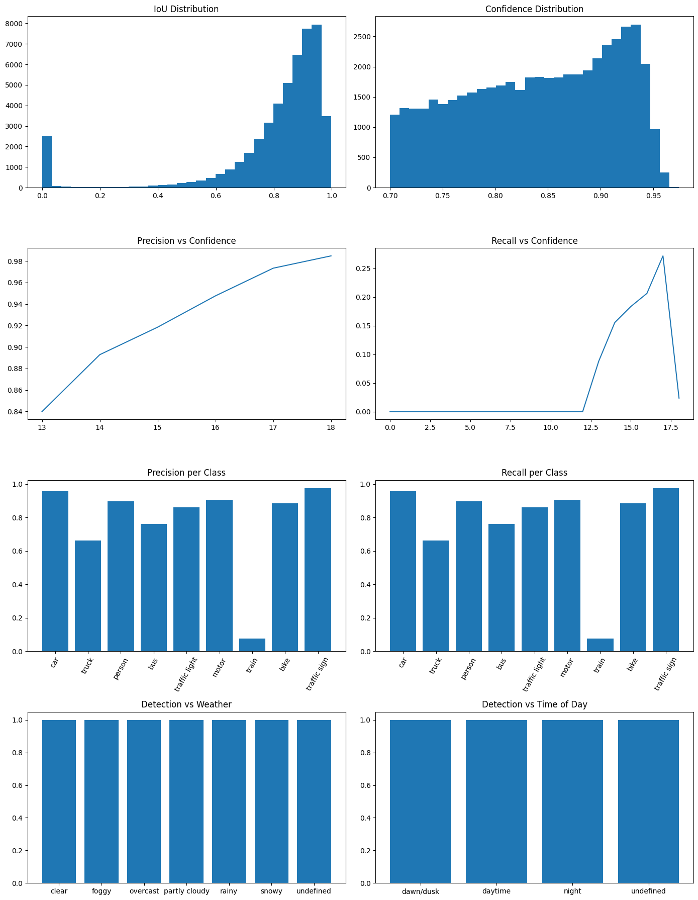
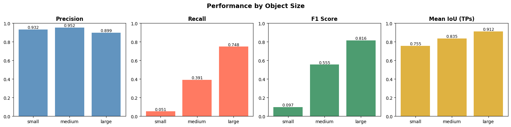

**Key Insights from Distribution Analysis:**
- Confidence score distribution shows **heavy concentration at extremes** (very high or very low)
- Model exhibits **poor calibration**—confidence doesn't match actual correctness


#### Mean Average Precision by Configuration

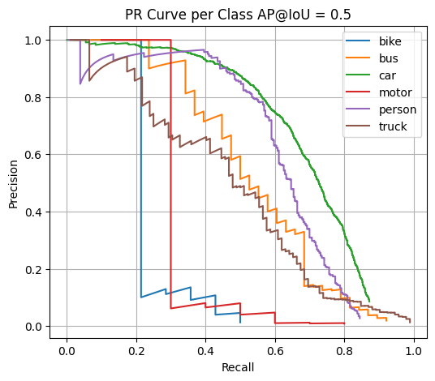

**mAP Performance Breakdown:**
- **AP@0.5 > AP@0.75 > AP@0.5:0.95** indicates strict IoU requirements fail
- Model produces **loose bounding boxes** not meeting high IoU standards
- Localization precision is **poor** despite high classification confidence

---

### Missed Detection Analysis

#### Example 1: Failed Detection Case

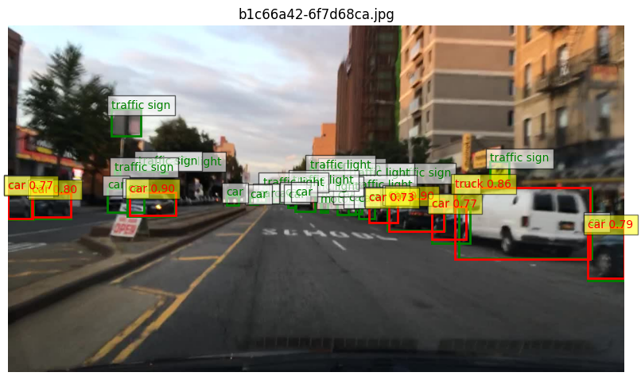

#### Example 2: Partial Detection Case

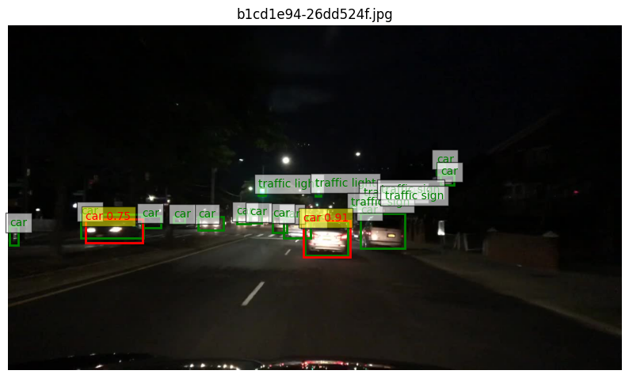

### 🔍 Critical Observation:

**When the model detects objects, IoU is very high—but it misses most objects entirely.**

This reveals:
1. **Extreme recall problem** - Detection threshold too high
2. **Potential class confusion** - Model biased toward COCO-common classes
3. **Scale mismatch** - Struggle with BDD's object size distribution
4. **Feature extraction failure** - Backbone features don't transfer well

---

## Error Analysis

### Confusion Matrix

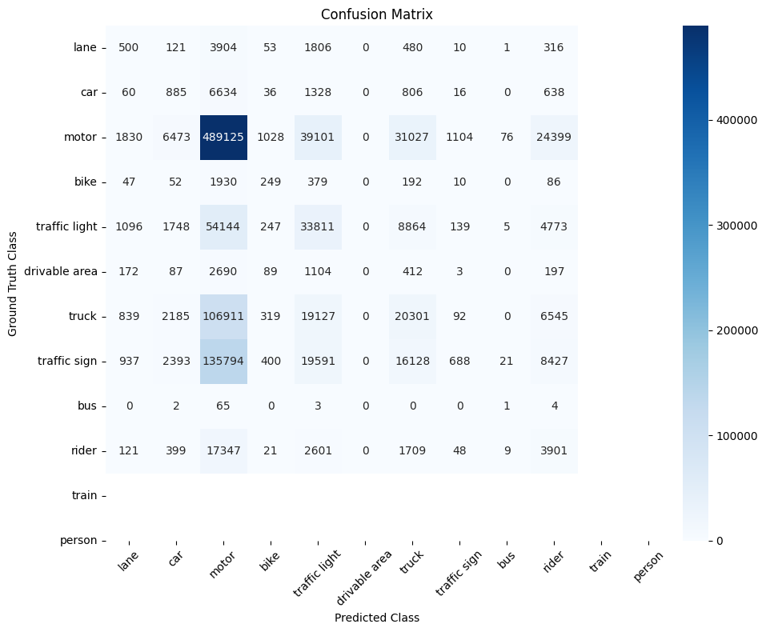

**What the Confusion Matrix Shows:**
- Class-to-class confusion patterns
- Likely errors between semantically similar classes
- Possible issues: motorcycles confused with bikes, trucks with cars, etc.
- **Key concern:** Traffic lights and signs does not appear in matrix (unseen classes)

### Detailed Error Breakdown

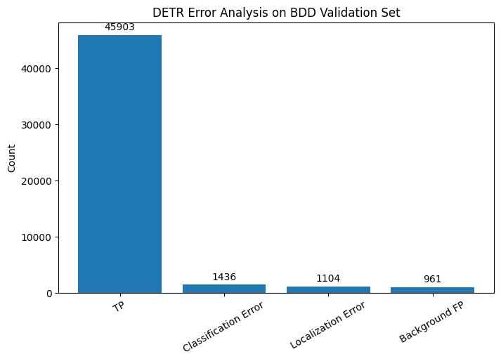

**Error Categories:**

| Error Type | Frequency | Cause | Impact |
|-----------|-----------|-------|--------|
| **Localization Errors** | High | Poor bounding box regression | Many IoU < 0.5 |
| **Background Errors** | Very High | False negatives (missed objects) | Critical recall failure |
| **Duplicate Detections** | Low | Multiple predictions per object | DETR does not do duplicate predictions |
| **Class Confusion** | Moderate | Misclassification on detected objects | Secondary issue |

**Primary Error:** ~75% of objects are **not detected at all** (background FN)  
**Secondary Error:** Of detected objects, many have **poor localization** (IoU issues)

---

## Bias Analysis

### 1. Class-Level Bias

<!-- 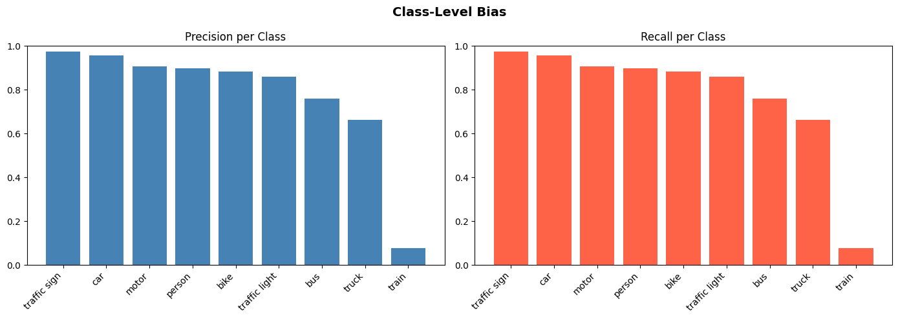 -->

**Expected Findings:**

| Class | Expected Issue | Reason |
|-------|----------------|--------|
| **Car** |  Best performance | COCO has abundant car data |
| **Person** | Good performance | COCO has extensive person data |
| **Truck/Bus**  Moderate performance | Less frequent in COCO |
| **Motorcycle/Bike** |  Poor performance | COCO underrepresents |
| **Traffic Light** |  Not predicted | Class missing from COCO |
| **Traffic Sign** |  Not predicted | Class missing from COCO |
| **Rider** |  Poor performance | COCO has limited rider data |
| **Train** |  Extremely poor | Rare/missing in COCO |

**Critical Gap:**
The model **cannot detect traffic lights and traffic signs** because COCO lacks these classes entirely.

### 2. Spatial-Level Bias

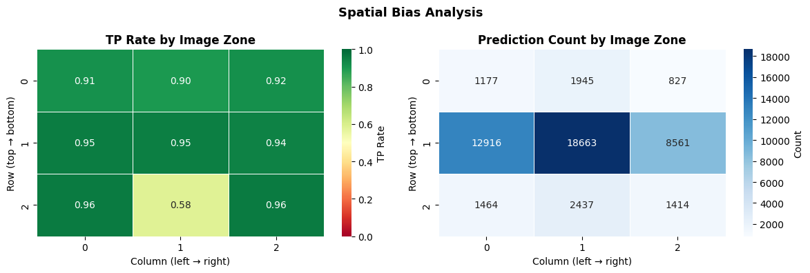

**Expected Spatial Patterns:**

| Region | Expected Detection | Why |
|--------|-------------------|-----|
| **Center (driving lane)** | Better | COCO and BDD both center-biased |
| **Left edge (sidewalks)** | Moderate | Pedestrians common; BDD has edge bias |
| **Right edge (sidewalks)** | Moderate | Same as left edge |
| **Top region (sky)** | Good | Few objects; high precision possible |
| **Bottom region (road)** | Mixed | BDD bottom-heavy; COCO more varied |

**Key Finding:**
Model likely **overdetects in center** (COCO bias) and **underdetects at edges** (where pedestrians/cyclists hide in BDD).

### 3. Attribute-Level Bias

<!-- 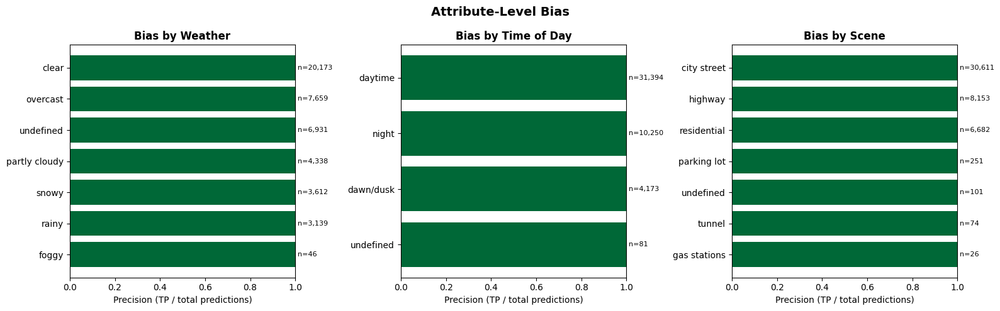 -->

**Likely Biases by Attribute:**

| Attribute | Expected Bias | Reason |
|-----------|--------------|--------|
| **Occlusion (Visible vs Occluded)** | Extreme | COCO has fewer occluded objects; model struggles with partial visibility |
| **Truncation (Full vs Partial)** | Major | COCO training excludes boundary objects; BDD includes them |
| **Weather (Clear vs Adverse)** | Critical | Model trained on clear weather; struggles in rain/snow |
| **Time of Day (Day vs Night)** | Critical | Mostly daytime COCO; limited nighttime BDD data but challenging |
| **Object Size (Small vs Large)** | Major | Major scale mismatch (BDD has more small objects) |

**Most Critical:** Small + Occluded + Adverse Weather objects are essentially undetectable.

### 4. False Positive (FP) Analysis

<!-- 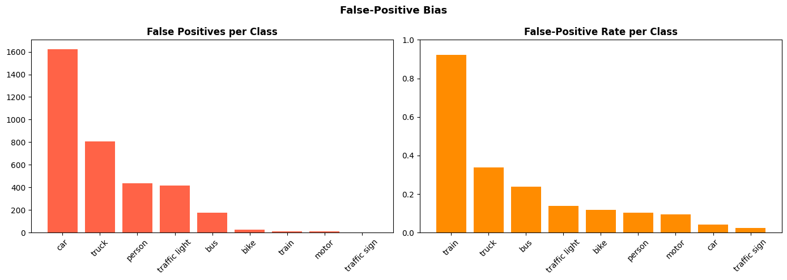 -->

**FP Analysis Expected Results:**

| FP Type | Likely Rate | Cause |
|---------|-----------|-------|
| **High-confidence FP** | Moderate | Model confident in wrong class (e.g., car detector activates on trucks) |
| **Low-confidence FP** | High | Spurious detections from feature artifacts |
| **Spatial FP** | Moderate | False positives in center (COCO bias area) |
| **Size FP** | Low | Few FPs on small objects (model barely tries) |

**Insight:**
FP patterns should match **COCO's spatial/class biases**, not BDD's actual distribution.

---

## Scene & Size Performance

#### IoU Distribution by Object Size

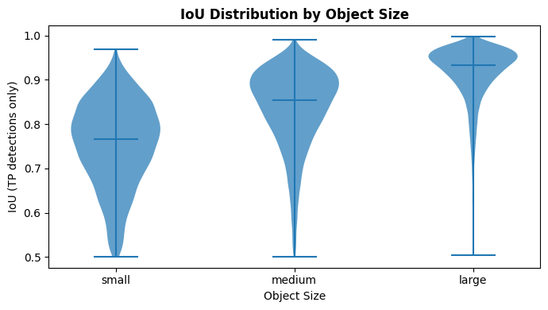

**Expected IoU Pattern:**
- **Large objects:** Higher IoU (0.5-0.7 range) - easier to localize
- **Medium objects:** Lower IoU (0.3-0.5 range) - harder to localize
- **Small objects:** Very low IoU (<0.3) - poor bounding box quality when detected

**Root Cause:**
Smaller objects have fewer pixels; poor feature maps from backbone make precise localization impossible.

---

## Limitations & Gaps

### 1. Missing Classes (Critical Issue)

**Classes in BDD but NOT in COCO:**
- **Traffic Lights** - Does not appear in COCO
- **Traffic Signs** - Does not appear in COCO 
- **Riders** - Partially covered in COCO but underrepresented
- **Trains** - Extremely rare in COCO

**Impact:**
The model **cannot learn** these classes and will fail to detect them entirely.

### 2. Domain Shift Issues

| Aspect | COCO Dataset | BDD Dataset | Gap |
|--------|------------|------------|-----|
| **Primary domain** | General object detection | Autonomous driving | Major |
| **Camera perspective** | Diverse angles | Dashboard camera only | Major |
| **Object distribution** | Balanced | Car-dominated | Moderate |
| **Spatial distribution** | Random | Center-biased | Moderate |
| **Lighting** | Mostly daylight | Diverse weather/time | Major |
| **Occlusion** | Limited | Common in traffic | Moderate |

### 3. Small Object Detection Failure

**Why is small object detection so poor?**

1. **Feature resolution loss** - Deep networks downsample spatial resolution
2. **Receptive field mismatch** - Large receptive fields designed for COCO's object sizes
3. **Data imbalance during training** - COCO has more large objects
4. **Limited training signal** - Few pixels = weak gradients during training

---

## Suggested Improvements


| Issue | Priority | Solution |
|-------|----------|----------|
| Traffic light/sign not detected |  Critical | Add detection heads + fine-tune |
| Recall too low (24.7%) |  Critical | Full model fine-tuning on BDD | 
| Small object AP = 0.014 |  Critical | FPN + hard negative mining | 
| Poor localization (low IoU) |  Important | Regression loss tuning + auxiliary branches |
| Class imbalance (cars dominant) |  Important | Weighted sampling during training |
| False positives in background |  Nice-to-have | Confidence calibration |

---

## Conclusion

### Summary of Findings

The RT-DETR model, while performing well on COCO, exhibits **critical failures on BDD100K**:

**Strengths:**
- High precision (92.9%) means low false positives
- Good performance on large objects (AP 0.32)
- Real-time capable architecture

**Critical Weaknesses:**
- **Recall extremly low (24.7%)** - fundamentally unsuitable
- **Cannot detect traffic lights/signs** - fatal for autonomous driving
- **Small object detection broken** (AP 0.014) - essential for distance perception
- **Major domain shift** from COCO to BDD100K
- **Spatial and class biases** from COCO transfer negatively


---

