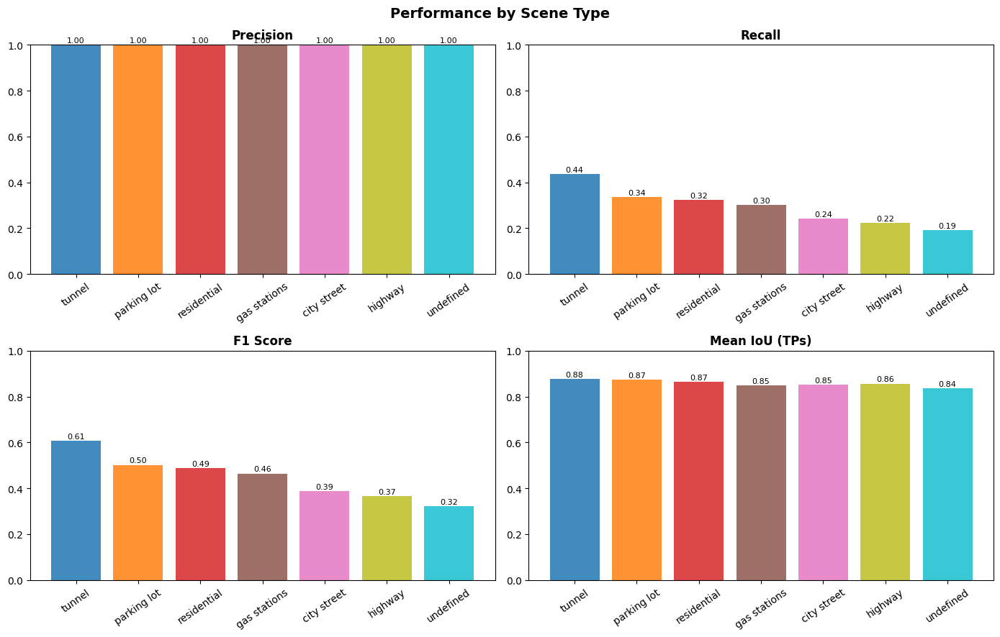
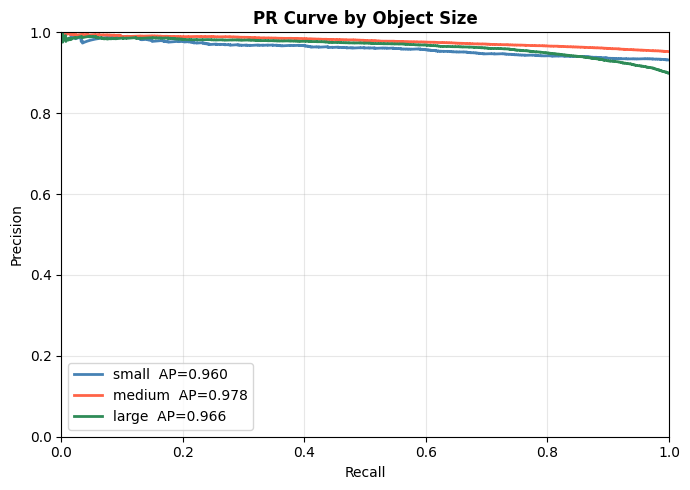
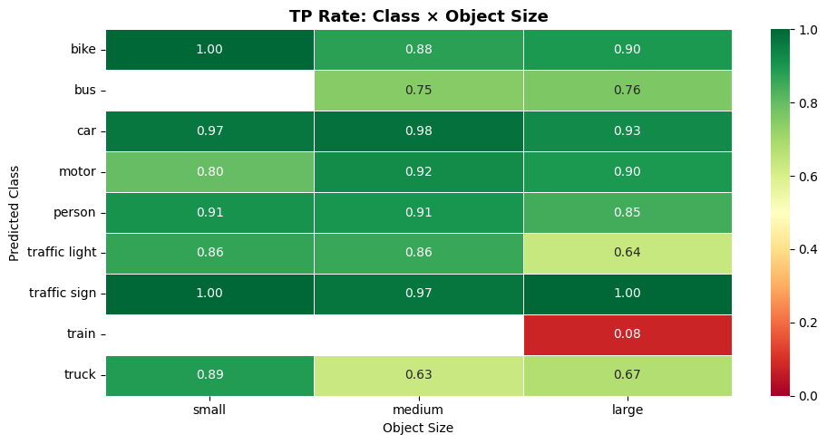
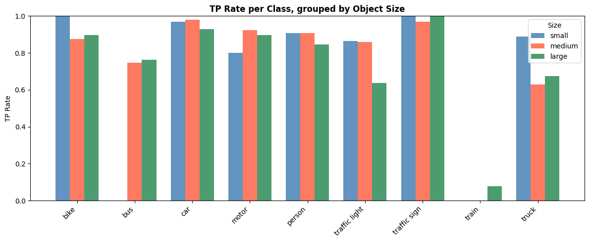

# Model Analysis
Find the model analysis in this [notebook](notebooks/model_analysis.ipynb)

Notable points regarding model selection :
- used model `PekingU/rtdetr_r50vd_coco_o365` pretrained on COCO Object detection dataset. 
- due to missing classes in COCO from BDD like `traffic lights` and `traffic signs` , evaluation on this classes are missing .
- model shows `Precision = 0.93
              Recall = 0.25` which is evident since the model has not been trained on BDD hence the recall is low and precision is high.

- some images 
 - as we can see model missed most of the data 
    
     , but whatever captures , its Iou is very high

- Analysis of model output
  - this is how differnet distributions are giving insights
  
  - with mAP
  

# Model Evaluation Results

## COCO Evaluation Metrics

### Average Precision (AP)

| Metric | Value |
|------|------|
| AP @[ IoU=0.50:0.95 | area=all | maxDets=100 ] | **0.122** |
| AP @[ IoU=0.50 | area=all | maxDets=100 ] | **0.173** |
| AP @[ IoU=0.75 | area=all | maxDets=100 ] | **0.132** |
| AP @[ IoU=0.50:0.95 | area=small | maxDets=100 ] | **0.014** |
| AP @[ IoU=0.50:0.95 | area=medium | maxDets=100 ] | **0.116** |
| AP @[ IoU=0.50:0.95 | area=large | maxDets=100 ] | **0.320** |

### Average Recall (AR)

| Metric | Value |
|------|------|
| AR @[ IoU=0.50:0.95 | area=all | maxDets=1 ] | **0.098** |
| AR @[ IoU=0.50:0.95 | area=all | maxDets=10 ] | **0.143** |
| AR @[ IoU=0.50:0.95 | area=all | maxDets=100 ] | **0.143** |
| AR @[ IoU=0.50:0.95 | area=small | maxDets=100 ] | **0.013** |
| AR @[ IoU=0.50:0.95 | area=medium | maxDets=100 ] | **0.137** |
| AR @[ IoU=0.50:0.95 | area=large | maxDets=100 ] | **0.370** |

---

## Detection Metrics Summary

| Metric | Score |
|------|------|
| **Precision** | **0.929** |
| **Recall** | **0.2474** |
| **F1 Score** | **0.3907** |

---

## Key Observations

- The model achieves **high precision (0.929)**, indicating that most predicted detections are correct.
- **Recall is relatively low (0.2474)**, suggesting that many objects in the dataset are not detected.
- Detection performance improves significantly for **large objects (AP = 0.320)**.
- Performance on **small objects is very poor (AP = 0.014)**, which is a common challenge in object detection tasks.
- Overall **F1 score of 0.39** indicates a trade-off between precision and recall.

## Confusion matrix 
- this is how confusion matrix looks like

## Error analysis
- Error analysis shows like this

## Performance of model on diff Scenes and Sizes

- performance on Diff scenes
  - this image needs to be changed
  - 

- performance on Diff Object sizes
  
  
  - PR Curve for object sizes
    
  - IOU distribution for it
    
  - Positive rate analysis
    
  - Positive Rate grouped by size
    

## Model Bias Analysis
  - Class level Bias
    
  - Spatial level Bias
    
  - Attribute level Bias
    

  - Checking for FP Bias
    

    

