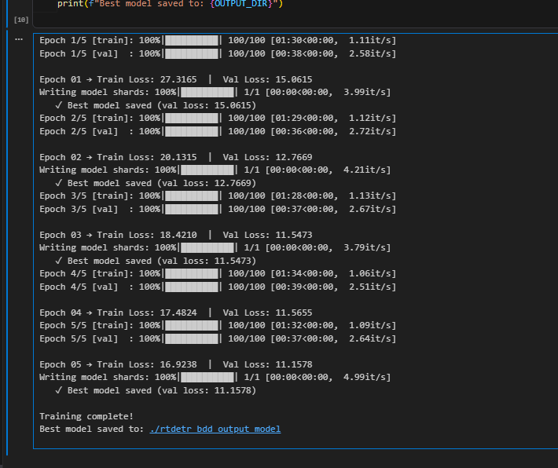
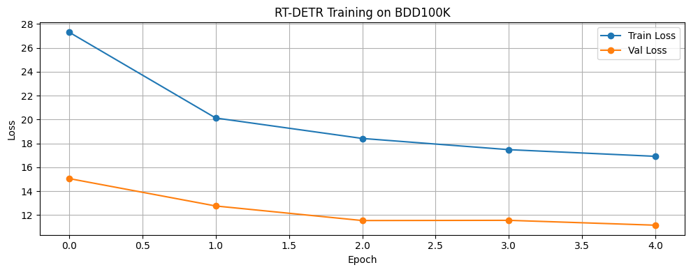
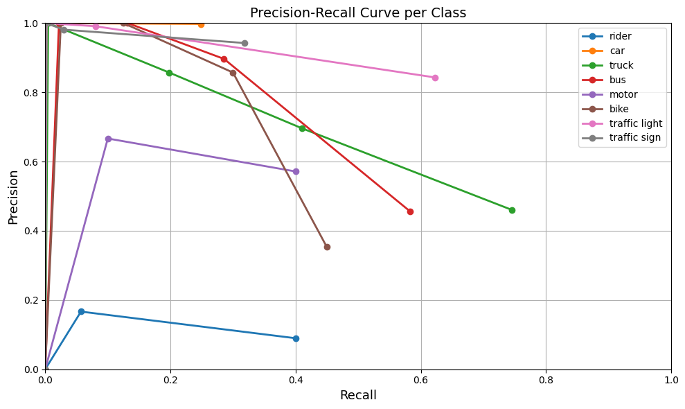

# Model Training
Find the model training in this [notebook](notebooks/model_training.ipynb)

Training is just for demonstration of the training loop using 500 images for 5 Epoches due to resource constraint of full scale training using 4050 RTX on a Laptop

# suggested improvements
- weighted loss can be used for training on the entire training  set since data shows imbalance in category present as well as the spatial variation is very high for certain categories like `train` , which means high variance is needed to capture the features which means more parameters use , hence more weightage to the loss for the category

- Following the same architecture /  loss fucntion  / optimizer
  -  snippet from code 
    
  - Epoch v/s Loss
    
  - Precision and recall curve
    
    

   
